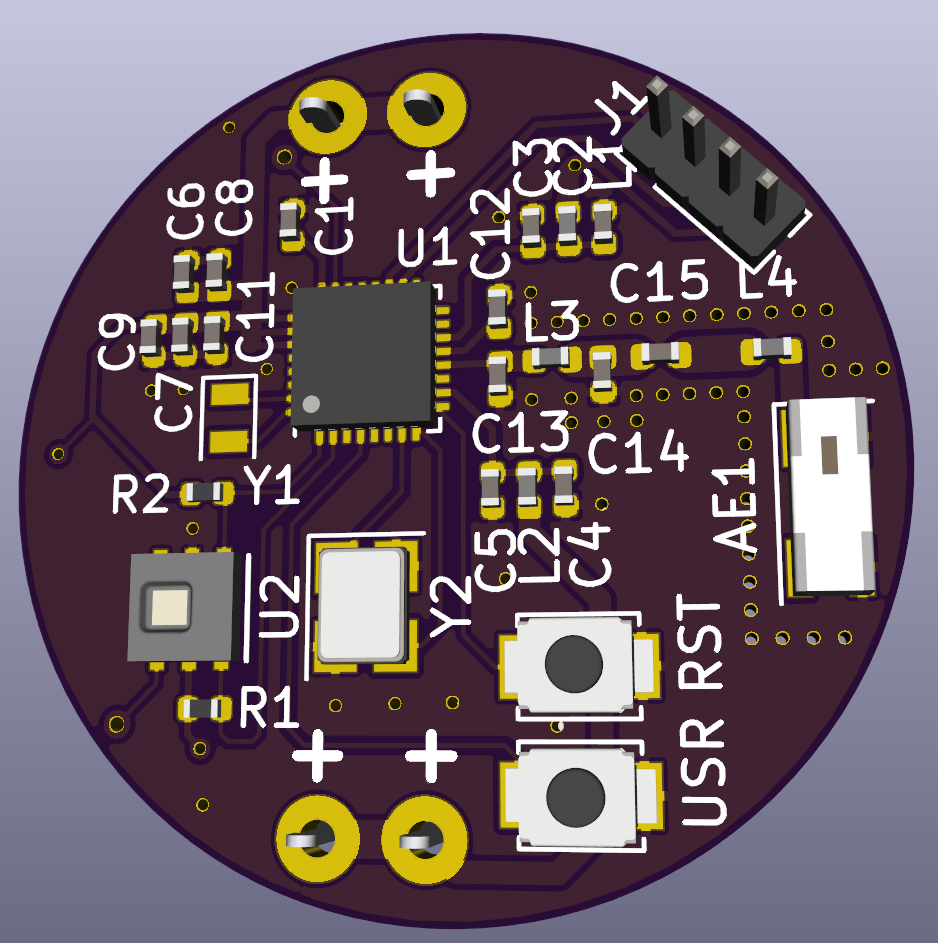
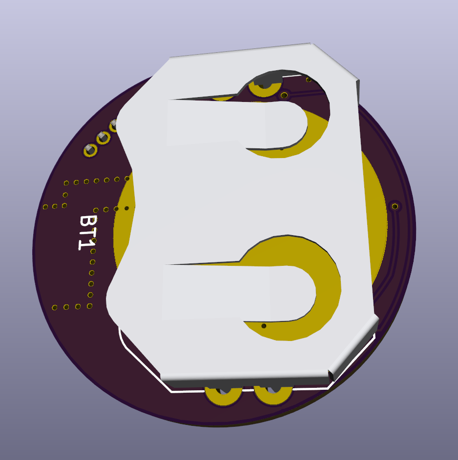

# Ilulissat
Ilulissat is a wireless environment sensor board, intended to run as low power as possible.

It consists of:
* [EFR32MG21](https://www.silabs.com/wireless/zigbee/efr32mg21-series-2-socs) Cortex M33 wireless chip
* [HDC2080](http://www.ti.com/product/HDC2080) Environment Sensor (Temperature and Relative Humidity)

The wireless chip supports both Bluetooth, Zigbee and OpenThread.

The first revision of the software will be written for Bluetooth Low energy using
a standard profile, e.g Temperature and Humidity, hopefully allowing it to use some standard
app off playstore/apple appstore.

## Images

